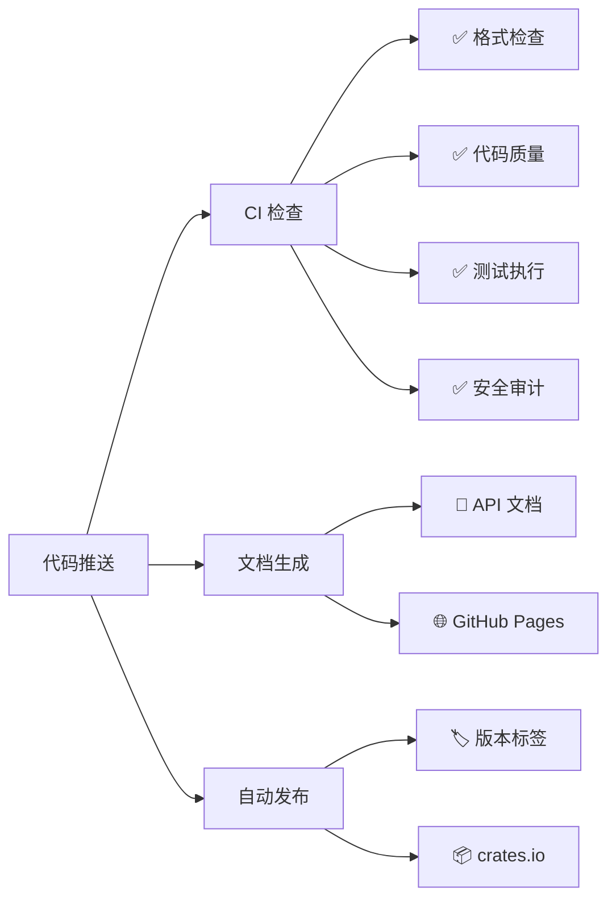

# GitHub Actions 文档

欢迎来到 `mudssky_utils` 项目的 GitHub Actions 文档中心。这里包含了项目 CI/CD 流水线的完整说明和配置指南。

## 📚 文档目录

### [GitHub Actions 工作流程说明](./github-actions.md)
详细介绍项目中配置的三个主要工作流程：
- **CI 工作流程** - 持续集成、测试、代码质量检查
- **文档工作流程** - API 文档生成和部署
- **发布工作流程** - 自动版本管理和发布

### [GitHub Actions 配置指南](./setup-guide.md)
从零开始配置 GitHub Actions 的完整指南：
- 前置要求和项目结构
- 逐步配置说明
- 密钥和环境变量设置
- 故障排除和最佳实践

## 🚀 快速开始

如果你是第一次使用本项目的 GitHub Actions 配置：

1. **了解工作流程**：先阅读 [工作流程说明](./github-actions.md) 了解整体架构
2. **配置环境**：按照 [配置指南](./setup-guide.md) 设置你的项目
3. **验证配置**：推送代码并检查 Actions 页面的执行状态

## 📊 工作流程状态

当前项目的工作流程状态：

## 🔧 工作流程概览

## 📋 检查清单

在使用 GitHub Actions 之前，请确保：

- [ ] 项目结构符合 Rust 标准
- [ ] `Cargo.toml` 包含完整的元数据
- [ ] 配置了必要的 GitHub Secrets
- [ ] 启用了 GitHub Pages（如需要）
- [ ] 设置了分支保护规则
- [ ] 遵循提交信息规范

## 🆘 获取帮助

如果遇到问题：

1. **查看文档**：首先检查相关文档是否有解决方案
2. **检查日志**：查看 GitHub Actions 页面的详细执行日志
3. **本地复现**：尝试在本地环境复现问题
4. **提交 Issue**：如果问题持续存在，请提交 GitHub Issue

## 📈 性能优化

我们的 CI/CD 流水线经过优化：

- **缓存策略**：智能缓存 Cargo 依赖和构建产物
- **并行执行**：多个作业并行运行以节省时间
- **矩阵构建**：在多个 Rust 版本上并行测试
- **增量构建**：只重新构建变更的部分

典型的执行时间：
- CI 检查：~3-5 分钟
- 文档生成：~2-3 分钟
- 发布流程：~5-8 分

## 🤝 贡献指南

如果你想改进我们的 GitHub Actions 配置：

1. Fork 项目
2. 创建功能分支
3. 提交变更（遵循提交规范）
4. 创建 Pull Request
5. 等待代码审查

## 📄 许可证

本文档和相关配置文件遵循项目的开源许可证。

---

**注意**：本文档会随着项目的发展持续更新。建议定期查看以获取最新信息。