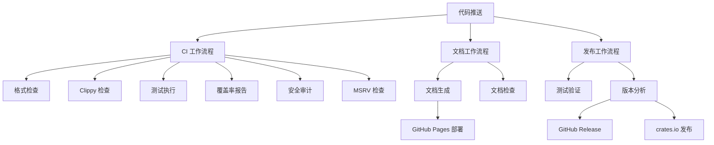

# GitHub Actions 工作流程说明

本项目使用 GitHub Actions 进行持续集成和持续部署 (CI/CD)。我们配置了三个主要的工作流程来确保代码质量、生成文档和自动发布。

## 工作流程概览

### 1. CI 工作流程 (`ci.yml`)

**触发条件：**
- 推送到 `main` 或 `develop` 分支
- 向 `main` 分支提交 Pull Request

**主要功能：**
- **多版本测试**：在 Rust stable、beta、nightly 版本上运行测试
- **代码格式检查**：使用 `cargo fmt` 检查代码格式
- **代码质量检查**：使用 `cargo clippy` 进行 linting
- **测试执行**：运行所有单元测试和文档测试
- **代码覆盖率**：生成代码覆盖率报告并上传到 Codecov
- **安全审计**：检查依赖项的安全漏洞
- **MSRV 检查**：验证最低支持的 Rust 版本 (1.70.0)

**作业详情：**

#### Test 作业
- 运行环境：Ubuntu Latest
- Rust 版本矩阵：stable, beta, nightly
- 缓存策略：缓存 cargo registry、index 和 build 目录
- 检查项目：
  - 代码格式化 (`cargo fmt --all -- --check`)
  - Clippy 检查 (`cargo clippy --all-targets --all-features -- -D warnings`)
  - 单元测试 (`cargo test --all-features`)
  - 文档测试 (`cargo test --doc`)

#### Coverage 作业
- 使用 `cargo-llvm-cov` 生成代码覆盖率
- 输出 LCOV 格式报告
- 自动上传到 Codecov

#### Security 作业
- 使用 `cargo audit` 检查依赖项安全漏洞
- 自动化安全扫描

#### MSRV 作业
- 验证项目在最低支持 Rust 版本上的兼容性
- 当前 MSRV：1.70.0

### 2. 文档工作流程 (`docs.yml`)

**触发条件：**
- 推送到 `main` 分支
- 推送标签 (以 'v' 开头)
- 向 `main` 分支提交 Pull Request

**主要功能：**
- **API 文档生成**：使用 `cargo doc` 生成 API 文档
- **GitHub Pages 部署**：自动部署文档到 GitHub Pages
- **文档质量检查**：验证文档的完整性和正确性

**作业详情：**

#### Generate Documentation 作业
- 生成不包含依赖项的文档 (`cargo doc --no-deps --all-features`)
- 创建重定向页面指向主库文档
- 仅在 `main` 分支推送时部署到 GitHub Pages
- 自定义域名：`mudssky-utils.docs.rs`

#### Check Documentation 作业
- 检查文档构建是否成功
- 包含私有项目的文档检查
- 将文档警告视为错误 (`RUSTDOCFLAGS="-D warnings"`)
- 运行文档测试

### 3. 发布工作流程 (`release.yml`)

**触发条件：**
- 推送到 `main` 分支

**主要功能：**
- **自动版本管理**：使用 semantic-release 进行版本管理
- **自动发布**：通过 semantic-release-cargo 插件自动发布到 crates.io
- **变更日志生成**：自动生成 CHANGELOG

**作业详情：**

#### Release 作业
- 运行完整测试套件确保质量
- 使用 semantic-release 分析提交信息
- 自动确定版本号 (patch/minor/major)
- 创建 GitHub Release
- 通过 semantic-release-cargo 插件自动发布到 crates.io
- 配置了 `environment: release` 和必要的权限
- 使用 `CARGO_REGISTRY_TOKEN` 密钥进行 crates.io 身份验证

## 缓存策略

所有工作流程都使用了统一的缓存策略来提高构建速度：

- **统一缓存**：使用 `Swatinem/rust-cache@v2` 统一管理所有缓存
- **智能缓存**：自动缓存 Cargo registry、index 和构建目录
- **容错机制**：配置 `cache-on-failure: true` 确保缓存失败时不影响构建
- **缓存键优化**：基于项目文件自动生成最优缓存键

## 环境变量

### 全局环境变量
- `CARGO_TERM_COLOR=always`：启用彩色输出

### 密钥配置
- `GITHUB_TOKEN`：GitHub 自动提供，用于访问仓库
- `CARGO_REGISTRY_TOKEN`：crates.io API 令牌，用于发布包到 crates.io（需要在仓库设置中配置）

## 状态徽章

可以在 README 中添加以下状态徽章：

```markdown
[](https://github.com/mudssky/mudssky_utils/actions/workflows/ci.yml)
[](https://github.com/mudssky/mudssky_utils/actions/workflows/docs.yml)
[](https://codecov.io/gh/mudssky/mudssky_utils)
```

## 工作流程依赖关系



## 最佳实践

1. **提交信息规范**：遵循 Angular 提交规范，确保 semantic-release 正确工作
2. **分支策略**：主要开发在 `develop` 分支，稳定版本合并到 `main`
3. **测试覆盖率**：保持高测试覆盖率，目标 > 90%
4. **文档同步**：确保代码变更时同步更新文档
5. **安全更新**：定期检查和更新依赖项

## 故障排除

### 常见问题

1. **格式检查失败**
   ```bash
   cargo fmt --all
   ```

2. **Clippy 警告**
   ```bash
   cargo clippy --all-targets --all-features -- -D warnings
   ```

3. **测试失败**
   ```bash
   cargo test --all-features
   ```

4. **文档构建失败**
   ```bash
   cargo doc --no-deps --all-features
   ```

### 调试工作流程

- 查看 Actions 页面的详细日志
- 本地复现工作流程步骤
- 检查环境变量和密钥配置
- 验证分支保护规则设置